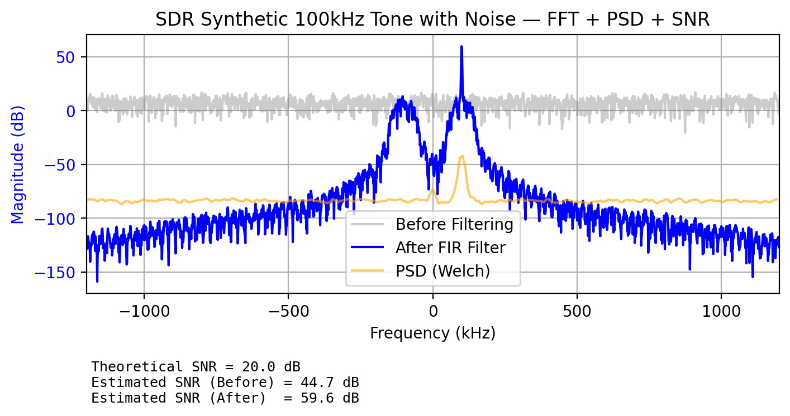

#SDR DSP Labs

This repo is a compilation and collection of DSP and SDR experiments focused on simulation, analysis, and visualization of various signals

Key topics covered:
- FFT analysis
- Power Spectral Density (PSD) with Wlech Averaging
-Gaussian Noise Modeling
- SNR Estimation and validation
- Signal Windowing and parseval's Th

| Lab | Description | Key Topics |
|------|--------------|-------------|
| [fft_sin](./fft_sin) | Basic FFT of a clean sinusoid | FFT, frequency bins, windowing |
| [gauss_noise_fft](./gauss_noise_fft) | Gaussian noise + FFT | Noise modeling, SNR, PSD |
| [measure_snr](./measure_snr) | SNR measurement and validation | SNR, Parseval’s theorem, Welch PSD |

  

S
Currently using RTL-SDR 3
