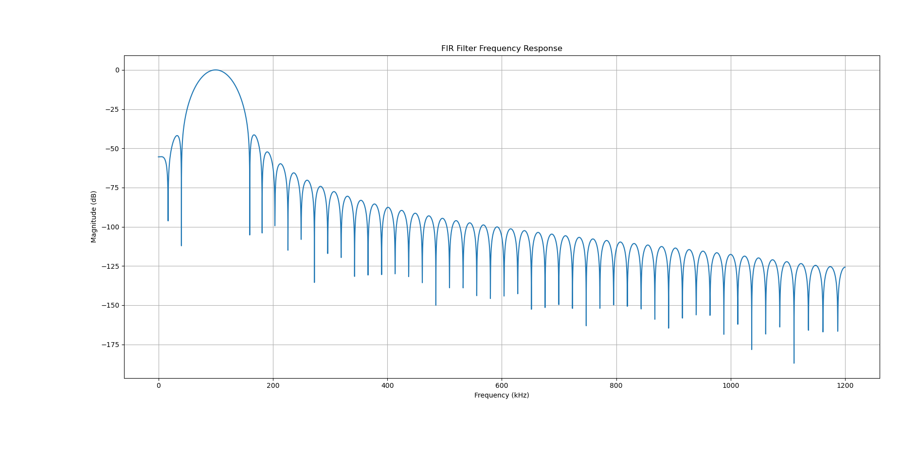
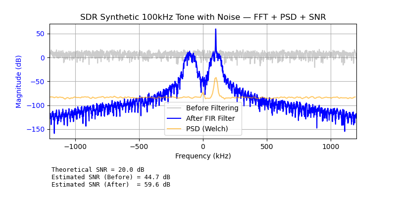

# Finite Impulse 

### Theory

$$
y[n] = \sum_{k=0}^{N-1} x[k] \cdot h[n-k]
$$

where :

- $h[k]$ : filter coefficients (defines filter shape or response) 
- $N$ : Number of coefficients = "filter order" + 1
- $x[n]$ : Input samples
- $y[n]$ : filtered output

#### Think of $h[k]$ as allowed time 'window' 

where in frequency (much more simple operation)

$$
Y(\omega) = X(\omega) \cdot H(\omega)
$$

The goal is to design H(f) as to remove all unwanted noise and keep our main signal.

### Objective

Demonstrate FIR Filtering by removing out-of-band noise (~100kHz tone)

### Concepts
- Fir Design with 'scipy.signal.firwin'
- Frequency-domain interpretation of filtering
- SNR improvement and bandwidth tradeoffs

### Results
| Metric    | Before | After|
|:-----------:|:-----------:|:----------:|
| Estimated SNR | 44.7 dB | 59.6 dB |

## FIR Frequency Response

  

## Resulting signal vs Non-Filtered

  

#### Some sources 
- https://www.precisionaudioservices.com/blog/conceptual-explanation-o../measure_snr/snr_demo.pngf-fir-filters
- https://en.wikipedia.org/wiki/Finite_impulse_response

